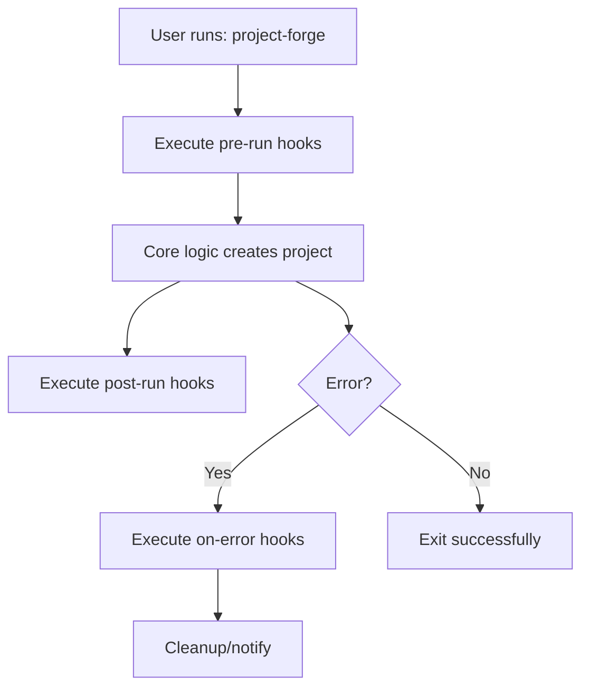

📘 Plugin Development Guide for Project Forge CLI

Version: 2.1.0

Author: Edun Oluwadarasimi David

Website: [https://edunoluwadarasimidavid.name.ng](https://edunoluwadarasimidavid.name.ng)

---

📖 Table of Contents

1. [What Are Plugins?](#what-are-plugins)
2. [Why Use Plugins?](#why-use-plugins)
3. [Plugin Architecture](#plugin-architecture)
4. [Installation & Setup](#installation--setup)
5. [Plugin API Reference](#plugin-api-reference)
6. [Hook Types Explained](#hook-types-explained)
7. [Beginner Tutorial: Your First Plugin](#beginner-tutorial-your-first-plugin)
8. [Intermediate Tutorial: GitHub Integration Plugin](#intermediate-tutorial-github-integration-plugin)
9. [Advanced Tutorial: Multi-Language Docker Generator](#advanced-tutorial-multi-language-docker-generator)
10. [Plugin Best Practices](#plugin-best-practices)
11. [Troubleshooting](#troubleshooting)
12. [Contributing Plugins](#contributing-plugins)

---

🤔 What Are Plugins?

Plugins are executable shell scripts that extend Project Forge CLI's functionality without modifying the core code. They hook into specific lifecycle events (pre-run, post-run, on-error) to:

- Validate input before project creation
- Generate additional files after project creation
- Integrate with external tools (GitHub, Docker, CI/CD)
- Send notifications
- Enforce organizational standards
- Add completely custom behavior

---

🎯 Why Use Plugins?

Benefit	Description	
Extensibility	Add features without waiting for core updates	
Customization	Tailor behavior to your workflow	
Reusability	Share plugins across teams	
Safety	Plugins can't break core functionality	
Performance	Only load plugins you need	
Enterprise	Enforce compliance, security, standards	

---

🔧 Plugin Architecture

Lifecycle Flow



Plugin Directory Structure

```
~/.project-forge/
└── plugins/
    ├── plugin-name.sh          # Main plugin file
    ├── plugin-name.conf        # Plugin-specific config (optional)
    └── plugin-name/            # Plugin assets (optional)
        └── templates/
```

---

⚙️ Installation & Setup

1. Base Plugin Directory Setup

```bash
# Create the plugins directory
mkdir -p ~/.project-forge/plugins

# Verify permissions (must be executable)
chmod 755 ~/.project-forge/plugins
```

2. Download Official Plugins

```bash
# Navigate to plugins directory
cd ~/.project-forge/plugins

# Download official plugins (examples)
curl -O https://edunoluwadarasimidavid.name.ng/plugins/github-auto.sh
curl -O https://edunoluwadarasimidavid.name.ng/plugins/vscode-workspace.sh
curl -O https://edunoluwadarasimidavid.name.ng/plugins/notify.sh

# Make them executable
chmod +x *.sh

# Verify installation
ls -la ~/.project-forge/plugins/
```

Output should be:

```
-rwxr-xr-x 1 user user 2048 Jan 20 10:30 github-auto.sh
-rwxr-xr-x 1 user user 1856 Jan 20 10:30 vscode-workspace.sh
-rwxr-xr-x 1 user user  892 Jan 20 10:30 notify.sh
```

3. Enable Plugin Execution

Plugins are automatically detected and loaded when placed in `~/.project-forge/plugins/`. No additional configuration needed.

To disable a plugin temporarily, rename it:

```bash
mv ~/.project-forge/plugins/notify.sh ~/.project-forge/plugins/notify.sh.disabled
```

---

📡 Plugin API Reference

Available Events

Event	When Triggered	Context Value	
`pre-run`	Before project creation starts	`"$PROJECT_NAME $PROJECT_TYPE"`	
`post-run`	After project creation succeeds	`"/full/path/to/project"`	
`on-error`	If project creation fails	`"Error message string"`	

Environment Variables

Every plugin receives these read-only variables:

```bash
#!/bin/env bash

# Event that triggered this plugin
echo "Event: $PF_EVENT"        # e.g., "post-run"

# Context passed by Project Forge
echo "Context: $PF_CONTEXT"    # e.g., "/home/user/myapp" or "myapp python"

# Project details (when available)
echo "Name: $PF_PROJECT_NAME"  # e.g., "myapp"
echo "Type: $PF_PROJECT_TYPE"  # e.g., "python"

# System paths
echo "Config Dir: $PF_CONFIG_DIR"   # e.g., "/home/user/.project-forge"
echo "Log File: $PF_LOG_FILE"       # e.g., "/home/user/.project-forge/logs/project-forge.log"

# Version info
echo "Logic Version: $PF_VERSION"   # e.g., "2.1.0"

# All loaded plugins (space-separated)
echo "Plugins: $PF_PLUGINS"

# User home
echo "Home: $HOME"
```

Return Codes

Code	Meaning	Action Taken by Core	
`0`	Success	Continue normally	
`1`	Error	Log warning, continue	
`100`	Abort	Stop project creation (pre-run only)	
`101`	Rollback	Trigger rollback to previous state (post-run only)	

---

🪝 Hook Types Explained

Pre-Run Hook

Use Cases: Validation, custom prompts, license checks.

Example: Prevent creating projects with reserved names.

```bash
# pre-run context: "myapp python"
if [[ "$PF_EVENT" = "pre-run" ]]; then
    PROJECT_NAME=$(echo "$PF_CONTEXT" | cut -d' ' -f1)
    
    # List of reserved names
    RESERVED=("test" "demo" "example")
    for r in "${RESERVED[@]}"; do
        if [[ "$PROJECT_NAME" = "$r" ]]; then
            echo "ERROR: '$PROJECT_NAME' is a reserved name. Aborting."
            exit 100  # Abort project creation
        fi
    done
fi
```

Post-Run Hook

Use Cases: File generation, integrations, notifications.

Example: Create VS Code workspace.

```bash
# post-run context: "/home/user/myapp"
if [[ "$PF_EVENT" = "post-run" ]]; then
    PROJECT_ROOT="$PF_CONTEXT"
    
    # Create VS Code settings
    mkdir -p "$PROJECT_ROOT/.vscode"
    echo '{ "editor.formatOnSave": true }' > "$PROJECT_ROOT/.vscode/settings.json"
fi
```

On-Error Hook

Use Cases: Cleanup, alerts, error logging.

Example: Send Slack notification on failure.

```bash
# on-error context: "Permission denied: /invalid/path"
if [[ "$PF_EVENT" = "on-error" ]]; then
    ERROR_MSG="$PF_CONTEXT"
    
    # Send Slack webhook (if configured)
    if [[ -n "$SLACK_WEBHOOK_URL" ]]; then
        curl -X POST -H 'Content-type: application/json' \
             --data "{\"text\":\"Project Forge Error: $ERROR_MSG\"}" \
             "$SLACK_WEBHOOK_URL"
    fi
fi
```

---

👶 Beginner Tutorial: Your First Plugin

Goal: Create a simple plugin that prints "Hello from Plugin!" after project creation.

Step 1: Create Plugin File

```bash
# Create plugin file
nano ~/.project-forge/plugins/hello-plugin.sh
```

Step 2: Write Plugin Code

```bash
#!/bin/env bash
#
# Hello Plugin - Simple example
# Trigger: post-run

# Only run on post-run event
if [[ "$PF_EVENT" != "post-run" ]]; then
    exit 0
fi

# Log to Project Forge log
echo "[HELLO-PLUGIN] Hello from plugin! Project: $PF_PROJECT_NAME" >> "$PF_LOG_FILE"

# Print to terminal
echo "🎉 Hello from Hello Plugin! Your project '$PF_PROJECT_NAME' is ready!"
```

Step 3: Make Executable

```bash
chmod +x ~/.project-forge/plugins/hello-plugin.sh
```

Step 4: Test It

Create a test project:

```bash
# Create a test project
project-forge

# When prompted:
# Project name: test-hello
# Type: python
# Git: no
```

You should see at the end:

```
🎉 Hello from Hello Plugin! Your project 'test-hello' is ready!
```

Verify in log:

```bash
grep "HELLO-PLUGIN" ~/.project-forge/logs/project-forge.log
```

---

🎯 Intermediate Tutorial: GitHub Integration Plugin

Goal: Automatically create a GitHub repository and push code after project creation.

Prerequisites:

1. Install GitHub CLI:

```bash
# macOS
brew install gh

# Ubuntu/Debian
sudo apt install gh

# Verify
gh auth status
```

2. Authenticate:

```bash
gh auth login
# Follow prompts (HTTPS, Token)
```

Step 1: Create Plugin

```bash
nano ~/.project-forge/plugins/github-auto.sh
```

Step 2: Write Advanced Plugin

```bash
#!/bin/env bash
#
# GitHub Auto-Repository Plugin v1.0
# Trigger: post-run
# Creates GitHub repo and pushes code

function log_plugin() {
    echo "[GITHUB-PLUGIN] $*" >> "$HOME/.project-forge/logs/project-forge.log"
}

# Only run after project creation
if [[ "$PF_EVENT" != "post-run" ]]; then
    exit 0
fi

PROJECT_ROOT="$PF_CONTEXT"
PROJECT_NAME=$(basename "$PROJECT_ROOT")
GITHUB_USER=$(gh auth status 2>&1 | grep -oE 'Logged in to github.com as \w+' | cut -d' ' -f6)

# Validate GitHub CLI
if ! gh auth status >/dev/null 2>&1; then
    log_plugin "GitHub CLI not authenticated. Skipping."
    echo "⚠️  GitHub CLI not authenticated. Run 'gh auth login' to enable auto-repo."
    exit 0
fi

# Check if already a git repo
if [[ ! -d "$PROJECT_ROOT/.git" ]]; then
    log_plugin "Not a git repository. Skipping."
    exit 0
fi

log_plugin "Creating GitHub repository: $REPO_NAME"

# Create private repo and push
cd "$PROJECT_ROOT"

# Check if remote already exists
if git remote get-url origin >/dev/null 2>&1; then
    log_plugin "Remote already exists. Skipping."
    echo "📡 Remote already configured. Skipping GitHub repo creation."
    exit 0
fi

# Create repo and push
if gh repo create "$REPO_NAME" \
    --private \
    --source=. \
    --remote=origin \
    --push \
    --description "Generated by Project Forge CLI" >/dev/null 2>&1; then
    
    REPO_URL="https://github.com/$GITHUB_USER/$REPO_NAME"
    log_plugin "Repository created and pushed: $REPO_URL"
    echo "🎉 GitHub repository created: $REPO_URL"
else
    log_plugin "Failed to create repository."
    echo "❌ Failed to create GitHub repository. Check permissions."
    exit 1
fi
```

Step 3: Enable Auto-Repo (Optional)

To make it automatic without prompting, set environment variable:

```bash
# Add to ~/.bashrc or ~/.zshrc
export AUTO_CREATE_REPO=true

# Source it
source ~/.bashrc
```

Step 4: Test Full Flow

```bash
# Create real project
project-forge

# When prompted:
# Project name: myapp
# Type: python
# Git: yes

# At the end, you'll see:
# 🎉 GitHub repository created: https://github.com/youruser/myapp
```

Verify:

```bash
# Check plugin log
grep "GITHUB-PLUGIN" ~/.project-forge/logs/project-forge.log

# Check GitHub
gh repo view myapp
```

---

🔬 Advanced Tutorial: Multi-Language Docker Generator

Goal: Generate production-ready Docker configurations for any project type.

Step 1: Create Advanced Plugin

```bash
nano ~/.project-forge/plugins/docker-pro.sh
```

Step 2: Complex Multi-File Generation

```bash
#!/bin/env bash
#
# Docker Pro Generator Plugin v2.0
# Trigger: post-run
# Creates optimized multi-stage Dockerfiles

function log_plugin() {
    echo "[DOCKER-PRO] $*" >> "$HOME/.project-forge/logs/project-forge.log"
}

if [[ "$PF_EVENT" != "post-run" ]]; then
    exit 0
fi

PROJECT_ROOT="$PF_CONTEXT"
PROJECT_TYPE="$PF_PROJECT_TYPE"

# Detect project files
HAS_REQ=false
HAS_PKG=false
HAS_HTML=false

[[ -f "$PROJECT_ROOT/requirements.txt" ]] && HAS_REQ=true
[[ -f "$PROJECT_ROOT/package.json" ]] && HAS_PKG=true
[[ -f "$PROJECT_ROOT/src/index.html" ]] && HAS_HTML=true

log_plugin "Generating Docker config for $PROJECT_TYPE (req:$HAS_REQ pkg:$HAS_PKG html:$HAS_HTML)"

# Function to create .dockerignore
create_dockerignore() {
    cat <<'EOF' > "$PROJECT_ROOT/.dockerignore"
.git
.env
*.md
*.log
.vscode/
.idea/
__pycache__/
node_modules/
venv/
*.pyc
*.pyo
.DS_Store
EOF
}

# Generate Dockerfile and docker-compose based on type
case "$PROJECT_TYPE" in
    python)
        # Multi-stage Python Dockerfile
        cat <<'EOF' > "$PROJECT_ROOT/Dockerfile"
# Build stage
FROM python:3.11-slim AS builder

WORKDIR /app

# Install build dependencies
RUN apt-get update && apt-get install -y build-essential libpq-dev

# Copy requirements and install
COPY requirements.txt .
RUN pip install --user --no-cache-dir -r requirements.txt

# Runtime stage
FROM python:3.11-slim AS runtime

WORKDIR /app

# Copy installed packages from builder
COPY --from=builder /root/.local /root/.local

# Copy application code
COPY . .

# Update PATH
ENV PATH=/root/.local/bin:$PATH

# Create non-root user
RUN useradd --create-home --shell /bin/bash appuser && \
    chown -R appuser:appuser /app
USER appuser

EXPOSE 8000

CMD ["python", "src/main.py"]
EOF
        
        # docker-compose.yml
        cat <<'EOF' > "$PROJECT_ROOT/docker-compose.yml"
version: '3.8'
services:
  app:
    build: .
    ports:
      - "8000:8000"
    volumes:
      - .:/app
    environment:
      - PYTHONUNBUFFERED=1
      - ENV=development
    restart: unless-stopped

  # Optional: Add database
  # db:
  #   image: postgres:15
  #   environment:
  #     POSTGRES_DB: myapp
  #     POSTGRES_USER: user
  #     POSTGRES_PASSWORD: password
  #   ports:
  #     - "5432:5432"
EOF
        ;;
    
    nodejs|react)
        # Multi-stage Node.js Dockerfile
        cat <<'EOF' > "$PROJECT_ROOT/Dockerfile"
# Build stage
FROM node:18-alpine AS builder

WORKDIR /app

COPY package*.json ./
RUN npm ci

COPY . .
RUN npm run build

# Runtime stage
FROM nginx:alpine AS runtime

COPY --from=builder /app/public /usr/share/nginx/html
COPY --from=builder /app/dist /usr/share/nginx/html

EXPOSE 80

CMD ["nginx", "-g", "daemon off;"]
EOF
        
        # docker-compose.yml
        cat <<'EOF' > "$PROJECT_ROOT/docker-compose.yml"
version: '3.8'
services:
  app:
    build: .
    ports:
      - "3000:80"
    volumes:
      - .:/app
      - /app/node_modules
    environment:
      - NODE_ENV=production
    restart: unless-stopped
EOF
        ;;
    
    web)
        # Simple nginx Dockerfile
        cat <<'EOF' > "$PROJECT_ROOT/Dockerfile"
FROM nginx:alpine

# Copy static files
COPY . /usr/share/nginx/html

# Copy custom nginx config if exists
COPY nginx.conf /etc/nginx/conf.d/default.conf 2>/dev/null || true

EXPOSE 80

CMD ["nginx", "-g", "daemon off;"]
EOF
        
        # docker-compose.yml
        cat <<'EOF' > "$PROJECT_ROOT/docker-compose.yml"
version: '3.8'
services:
  web:
    build: .
    ports:
      - "8080:80"
    volumes:
      - ./src:/usr/share/nginx/html
      - ./nginx.conf:/etc/nginx/conf.d/default.conf:ro
    restart: unless-stopped
EOF
        ;;
esac

# Create .dockerignore
create_dockerignore

# Create README-DOCKER.md
cat <<EOF > "$PROJECT_ROOT/README-DOCKER.md"
# Docker Instructions for $PROJECT_NAME

## Quick Start
\`\`\`bash
# Build
docker-compose build

# Run
docker-compose up

# Run in background
docker-compose up -d

# View logs
docker-compose logs -f

# Stop
docker-compose down
\`\`\`

## Production Deploy
\`\`\`bash
docker-compose -f docker-compose.yml -f docker-compose.prod.yml up
\`\`\`
EOF

log_plugin "Docker configuration complete"
echo "🐳 Docker configuration created (Dockerfile + docker-compose.yml)"
```

Step 3: Test Complex Plugin

```bash
# Create Node.js project
project-forge

# Name: myapp
# Type: nodejs
# Git: yes

# At the end:
# 🐳 Docker configuration created (Dockerfile + docker-compose.yml)

# Verify
cd myapp
cat Dockerfile
cat docker-compose.yml
docker-compose up --build
```

---

✅ Plugin Best Practices

1. Safety First
- Always validate input: Check if files exist before modifying
- Use `set -e`: Exit on error to prevent partial execution
- Idempotency: Running plugin twice should be safe

```bash
# BAD: Overwrites existing file
echo "data" > "$PROJECT_ROOT/config.json"

# GOOD: Check first
if [[ ! -f "$PROJECT_ROOT/config.json" ]]; then
    echo "data" > "$PROJECT_ROOT/config.json"
else
    log_plugin "config.json already exists, skipping"
fi
```

2. Logging
- Use plugin-specific log prefix
- Write to `$PF_LOG_FILE` for persistence
- Echo to terminal for immediate feedback

```bash
log_plugin() {
    local msg="[MY-PLUGIN] $*"
    echo "$msg" >> "$PF_LOG_FILE"
    echo "$msg"  # Also show to user
}
```

3. Performance
- Avoid heavy operations in `pre-run` (delays project creation)
- Use background tasks for long operations
- Cache expensive computations

```bash
# BAD: Slow network call in pre-run
curl -s "https://api.example.com/data" > "$CACHE_FILE"

# GOOD: Cache with TTL
if [[ ! -f "$CACHE_FILE" ]] || [[ $(find "$CACHE_FILE" -mtime +1) ]]; then
    curl -s "https://api.example.com/data" > "$CACHE_FILE"
fi
```

4. Configuration
- Support environment variables for plugin options
- Use plugin-specific config files for complex settings

```bash
# Check for plugin-specific config
PLUGIN_CONFIG="$PF_CONFIG_DIR/plugins/my-plugin.conf"
if [[ -f "$PLUGIN_CONFIG" ]]; then
    source "$PLUGIN_CONFIG"
fi
```

5. Error Handling
- Graceful degradation: Don't fail if optional tool is missing
- Clear error messages: Tell user how to fix

```bash
if ! command -v some-tool >/dev/null 2>&1; then
    log_plugin "Warning: some-tool not installed. Skipping feature."
    echo "⚠️  Install 'some-tool' to enable this plugin feature."
    exit 0  # Don't fail, just skip
fi
```

---

🔍 Troubleshooting

Plugin Not Executing

Check:

```bash
# 1. Is plugin executable?
ls -l ~/.project-forge/plugins/

# 2. Check log for errors
grep "PLUGIN" ~/.project-forge/logs/project-forge.log

# 3. Test plugin manually
export PF_EVENT="post-run"
export PF_CONTEXT="/tmp/test"
bash ~/.project-forge/plugins/your-plugin.sh
```

Plugin Causing Errors

Debug mode:

```bash
# Run with debug to see plugin execution
PROJECT_FORGE_DEBUG=2 project-forge
```

Disable problematic plugin:

```bash
mv ~/.project-forge/plugins/bad-plugin.sh ~/.project-forge/plugins/bad-plugin.sh.disabled
```

Permission Issues

```bash
# Fix plugin permissions
chmod +x ~/.project-forge/plugins/*.sh

# Fix config directory ownership
sudo chown -R $USER:$USER ~/.project-forge
```

---

🤝 Contributing Plugins

Submitting to Official Repository

1. Fork the repo: [https://github.com/edunoluwadarasimidavid/Project-Bootstrapper](https://github.com/edunoluwadarasimidavid/Project-Bootstrapper)

2. Create plugin in `plugins/` directory:

```bash
mkdir -p plugins/your-plugin
touch plugins/your-plugin.sh plugins/your-plugin/README.md
```

3. Include documentation:

```bash
# plugins/your-plugin/README.md
# Your Plugin Name
# Description, installation, usage
```

4. Add test:

```bash
# tests/test-your-plugin.sh
# Test cases for your plugin
```

5. Submit pull request with:
- Plugin code
- Documentation
- Test cases
- Screenshot/demo

---

📦 Plugin Pack Distribution

Creating a Plugin Pack

Bundle multiple plugins for easy distribution:

```bash
# Create plugin pack
mkdir my-plugin-pack
cp plugins/{plugin1.sh,plugin2.sh} my-plugin-pack/
cp config.toml my-plugin-pack/

# Create install script
cat > my-plugin-pack/install.sh <<'EOF'
#!/bin/env bash
# Install plugin pack
PACK_DIR="$(cd "$(dirname "$0")" && pwd)"
mkdir -p ~/.project-forge/plugins
cp "$PACK_DIR"/*.sh ~/.project-forge/plugins/
chmod +x ~/.project-forge/plugins/*.sh
echo "Plugin pack installed"
EOF

chmod +x my-plugin-pack/install.sh

# Create archive
tar -czf plugin-pack-v1.0.tar.gz my-plugin-pack/
```

Users install:

```bash
curl -O https://example.com/plugin-pack-v1.0.tar.gz
tar -xzf plugin-pack-v1.0.tar.gz
cd my-plugin-pack
./install.sh
```

---

🎓 Plugin Certification (Enterprise)

For enterprise customers, plugins can be digitally signed:

```bash
# Sign your plugin
gpg --detach-sign --armor your-plugin.sh

# Users verify before installation
gpg --verify your-plugin.sh.sig your-plugin.sh
```

Enterprise config:

```toml
# ~/.project-forge/config.toml
enterprise_mode = true
require_signed_plugins = true
trusted_signers = ["Edun Oluwadarasimi David"]
```

---

